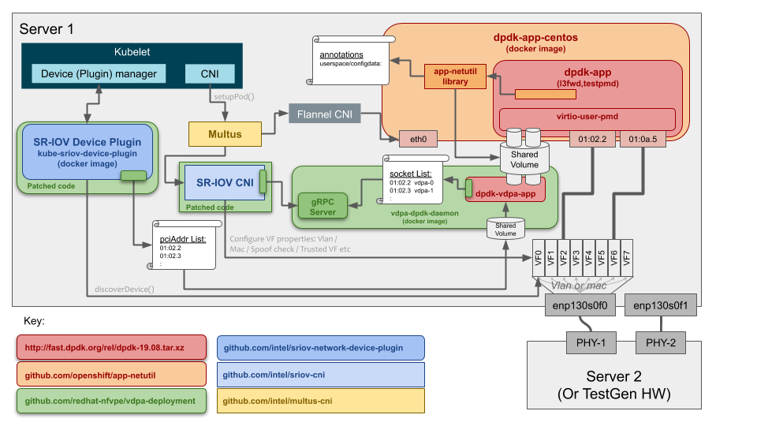

# vdpa-deployment
GO code and example YAML files to deploy vDPA VFs in a container running in kubernetes.

   * [Overview](#overview)
   * [Quick Start](#quick-start)
      * [Kubernetes < 1.16](#kubernetes--116)
      * [Prerequisties](#prerequisties)
   * [vdpa-dpdk-image](#vdpa-dpdk-image)
   * [server-image](#server-image)
      * [client-image](#client-image)
      * [gRPC proto](#grpc-proto)
   * [SR-IOV](#sr-iov)
      * [vDPA Setup](#vdpa-setup)
      * [sriov-dp](#sriov-dp)
         * [Network-Attachment-Definition](#network-attachment-definition)
         * [ConfigMap](#configmap)
         * [SR-IOV Device Plugin Daemonset](#sr-iov-device-plugin-daemonset)
      * [sriov-cni](#sriov-cni)
   * [Sample Application](#sample-application)
      * [dpdk-app-centos](#dpdk-app-centos)
      * [Scylla](#scylla)
         * [Scylla Init-Container](#scylla-init-container)
         * [Scylla Docker Image](#scylla-docker-image)
         * [Scylla Deployment](#scylla-deployment)

## Overview
vhost Data Path Acceleration (vDPA) utilizes virtio ring compatible
devices to serve virtio driver directly to enable datapath acceleration
(i.e. - vrings are implemented in NIC instead of in software on host).
NICs that support vDPA behave similar to NICs that support SR-IOV in the
fact that the Physical Function (PF) can be divided up into multiple
Virtual Functions (VF). 

This repo, inconjunction with several other repos, enable vDPA VFs to
be used in a container. The following diagram shows the set of components
used and how this repo fits into the end solution:



## Quick Start
To leverage this repo, download this repo, run `make all` and then copy
the SR-IOV CNI to the proper locacation:

```
   cd $GOPATH/src/
   go get github.com/redhat-nfvpe/vdpa-deployment
   cd github.com/redhat-nfvpe/vdpa-deployment/
   make all
   sudo cp bin/sriov /opt/cni/bin/. 
```

`make all` builds the following images/binaries:
* `vdpa-daemonset` docker image: Located in the
  **vdpa-dpdk-image** directory. This image runs as a Daemonset on each node
  and manages the virtio unix socketfiles used by the virtio control channel.
  See [vdpa-dpdk-image](#vdpa-dpdk-image).
* `vdpa-grpc-server` docker image: Located in the **server-image**
  directory. This image is also runs in the same Daemonset on each node as
  `vdpa-daemonset`. The `vdpa-grpc-server` image provides a gRPC
  Server for the SR-IOV CNI to call to retrieve the VF PCI Address to unix
  socketfile mapping. See [server-image](#server-image).
* `sriov-device-plugin` docker image: Located in the **sriov-dp**
  directory. This image takes the upstream SR-IOV Device Plugin and applies
  some local patches to enable it to work with vDPA as well. See
  [sriov-dp](#sriov-dp).
* `sriov` CNI binary: Located in the **sriov-cni** directory. This image takes
  the upstream SR-IOV CNI and applies some local patches to enable it to work
  with vDPA as well. The binary is located in `bin/sriov`. This file must be
  copied to the default CNI directory, typically `/opt/cni/bin/`. See
  [sriov-cni](#sriov-cni).

The sample application used in this deployment is the `dpdk-app-centos`
docker image. The following set of commands will download and build the image.
```
   cd $GOPATH/src/
   go get github.com/openshift/app-netutil
   cd github.com/openshift/app-netutil/
   make dpdk_app
```

The following set of commands will deploy the images above.
'NOTE:' Update configMap-vdpa.yaml to match local HW.
```
   cd $GOPATH/src/github.com/redhat-nfvpe/vdpa-deployment/
   kubectl create -f ./deployment/vdpa-daemonset.yaml
   kubectl create -f ./deployment/netAttach-vdpa-dpdk-a.yaml
   kubectl create -f ./deployment/netAttach-vdpa-dpdk-b.yaml
   kubectl create -f ./deployment/configMap-vdpa.yaml
   kubectl create -f ./deployment/sriovdp-vdpa-daemonset.yaml
   kubectl get node nfvsdn-22-oot -o json | jq '.status.allocatable'

   kubectl create -f ./deployment/vdpa-pod-1.yaml
```

The following set of commands will tear down the deployment above. 
```
   cd $GOPATH/src/github.com/redhat-nfvpe/vdpa-deployment/
   kubectl delete pod vdpa-pod-1
   kubectl delete -f ./deployment/sriovdp-vdpa-daemonset.yaml
   kubectl delete -f ./deployment/configMap-vdpa.yaml
   kubectl delete -f ./deployment/netAttach-vdpa-dpdk-b.yaml
   kubectl delete -f ./deployment/netAttach-vdpa-dpdk-a.yaml
   kubectl delete -f ./deployment/vdpa-daemonset.yaml
```

### Kubernetes < 1.16
The above deployment works for Kubernetes 1.16+. In Kubernetes 1.16,
some of the beta features (like DaemonSets) were removed from beta and
promoted to GA. If running an older version of Kubernetes, use the
files located in the `./deployment/k8s-pre-1-16/` subdirectory which
rollback these changes:
```
   cd $GOPATH/src/github.com/redhat-nfvpe/vdpa-deployment/
   ls deployment/k8s-pre-1-16/
    sriovdp-vdpa-daemonset.yaml  vdpa-daemonset.yaml
```

### Prerequisties
This setup assumes:
* Running on baremetal.
* Kubernetes is installed.
* Multus CNI is installed.
* vDPA VFs have already been created on the PFs being used.

For reference, this repo was developed and tested on:
* Fedora 29 - kernel 5.2.17-100.fc29.x86_64
* GO: go1.12.7
* Docker: 19.03.2
* Kubernetes: v1.16.1

## vdpa-dpdk-image
vDPA leverages existing userspace virtio/vHost protocol to negotiate
the vrings used to pass data traffic. A typical vHost implemenation
uses a userspace vSwitch on the host (like OvS-DPDK or VPP), which
serves as either the server or client of the vHost. Then if running
a VM, QEMU serves as the other side of the vHost (client or server).
If not running a VM but a container, then code like a DPDK application
running in the container serves as the other side of the vHost
(client or server).

For vDPA, where the vrings are being handled by the hardware (NIC),
something needs to handle the vhost negotiation on behalf of the
NIC. In this implementation, this logic is handled by a sample application
provided by the DPDK library (examples/vdpa) which is built and run
in a container as a DaemonSet.

The **vdpa-dpdk-image** directory contains the files to build the
`vdpa-daemonset` docker image. This image runs the vDPA sample
application from DPDK. The `entrypoint.sh` script waits for a the set
of PCI Addresses of the vDPA VFs to be written to the file 
`/var/run/vdpa/pciList.dat`, which is provided by the SR-IOV Device
Plugin (see [sriov-dp](#sriov-dp)).

The `entrypoint.sh` script then reads this file and passes the set of
PCI Address associated with the vDPA VF to the vDPA sample application.
The vDPA sample application then creates the unix socketfiles and handles
the vring negotiation on behalf of the NIC.


The `/var/run/vdpa/pciList.dat` file is just a list of PCI Address
associated with vDPA VFs. For testing purpose, the file can be generated
manually (where the PCI addresses match the VFs on the server):
```
$ sudo vi /var/run/vdpa/pciList.dat
0000:83:00.2
0000:83:00.3
0000:83:00.4
0000:83:00.5
0000:83:00.6
0000:83:00.7
0000:83:01.0
0000:83:01.1
0000:83:01.2
0000:83:01.3
0000:83:01.4
0000:83:01.5
0000:83:01.6
0000:83:01.7
0000:83:02.0
0000:83:02.1
```

Other components in the solution need the PCI Address to socketfile
mapping so the other side of the vhost channel can be setup. The vDPA
sample application has been augmented (with `sed` commands) to export
this mapping to a file (`/var/run/vdpa/socketList.dat`). This file is
read by the gRPC Server (see [server-image](#server-image)), which
exposes the data via a gRPC request/response.

To build the docker image:
```
   cd $GOPATH/src/github.com/redhat-nfvpe/vdpa-deployment
   make vdpa-image
   -- OR --
   make all
```

This image will be deployed along with the `vdpa-grpc-server`
docker image using the following command:
```
   cd $GOPATH/src/github.com/redhat-nfvpe/vdpa-deployment/
   kubectl create -f ./deployment/vdpa-daemonset.yaml
```

## server-image
The **server-image** directory contains the files to build the
`vdpa-grpc-server` docker image. This image runs a gRPC Server
that is called from a CNI trying to add a vDPA VF to a container.
In this solution, the SR-IOV CNI has been modified with gRPC Client
code to call this server (see [sriov-cni](#sriov-cni)) and retrieve
the associated unix socketfile. 

To build the docker image:

```
   cd $GOPATH/src/github.com/redhat-nfvpe/vdpa-deployment
   make server-image
   -- OR --
   make all
```

This image will be deployed along with the `vdpa-daemonset`
docker image using the following command:
```
   cd $GOPATH/src/github.com/redhat-nfvpe/vdpa-deployment/
   kubectl create -f ./deployment/vdpa-daemonset.yaml
```

### client-image
The client code is used only for testing. The testing is not automated
yet. Both the client and server can be built and run locally.

```
   cd $GOPATH/src/github.com/redhat-nfvpe/vdpa-deployment
   make server
   make client
```

Then run the server, which runs until killed:
```
$ sudo ./bin/vdpa-server 
2019/10/04 09:56:30 INFO: loadInterfaces - Using ExampleData.
2019/10/04 09:56:30 INFO: Loaded:
2019/10/04 09:56:30   PCI: 0000:83:00.2  Socketpath: /var/run/vdpa/vhost/vdpa-0
2019/10/04 09:56:30   PCI: 0000:83:00.3  Socketpath: /var/run/vdpa/vhost/vdpa-1
2019/10/04 09:56:30   PCI: 0000:83:00.4  Socketpath: /var/run/vdpa/vhost/vdpa-2
2019/10/04 09:56:30   PCI: 0000:83:00.5  Socketpath: /var/run/vdpa/vhost/vdpa-3
2019/10/04 09:56:30   PCI: 0000:83:00.6  Socketpath: /var/run/vdpa/vhost/vdpa-4
2019/10/04 09:56:30   PCI: 0000:83:00.7  Socketpath: /var/run/vdpa/vhost/vdpa-5
2019/10/04 09:56:30   PCI: 0000:83:01.0  Socketpath: /var/run/vdpa/vhost/vdpa-6
2019/10/04 09:56:30   PCI: 0000:83:01.1  Socketpath: /var/run/vdpa/vhost/vdpa-7
2019/10/04 09:56:30   PCI: 0000:83:01.2  Socketpath: /var/run/vdpa/vhost/vdpa-8
2019/10/04 09:56:30   PCI: 0000:83:01.3  Socketpath: /var/run/vdpa/vhost/vdpa-9
2019/10/04 09:56:30   PCI: 0000:83:01.4  Socketpath: /var/run/vdpa/vhost/vdpa-10
2019/10/04 09:56:30   PCI: 0000:83:01.5  Socketpath: /var/run/vdpa/vhost/vdpa-11
2019/10/04 09:56:30   PCI: 0000:83:01.6  Socketpath: /var/run/vdpa/vhost/vdpa-12
2019/10/04 09:56:30   PCI: 0000:83:01.7  Socketpath: /var/run/vdpa/vhost/vdpa-13
2019/10/04 09:56:30   PCI: 0000:83:02.0  Socketpath: /var/run/vdpa/vhost/vdpa-14
2019/10/04 09:56:30   PCI: 0000:83:02.1  Socketpath: /var/run/vdpa/vhost/vdpa-15
2019/10/04 09:56:30 INFO: Starting vdpaDpdk gRPC Server at: /var/run/vdpa/vdpa.sock
2019/10/04 09:56:30 INFO: vdpaDpdk gRPC Server listening.
```

Then in another window, run the client, which queries the server for
one valid PCI Address, and one unknown PCI Address:
```
$ sudo ./bin/vdpa-client 
2019/10/04 09:56:45 INFO: Starting vDPA-DPDK gRPC Client.
2019/10/04 09:56:45 INFO: Getting socketpath for PCI Address 0000:83:00.5
2019/10/04 09:56:45 INFO: Retrieved socketpath - /var/run/vdpa/vhost/vdpa-3
2019/10/04 09:56:45 INFO: Getting socketpath for PCI Address 0000:87:00.5
2019/10/04 09:56:45 INFO: Retrieved socketpath - 
$
```

The server should then output as the requests are received.
```
2019/10/04 09:56:45 INFO: Received request for PCI Address 0000:83:00.5
2019/10/04 09:56:45 INFO: Found File: /var/run/vdpa/vhost/vdpa-3
2019/10/04 09:56:45 INFO: Received request for PCI Address 0000:87:00.5
2019/10/04 09:56:45 INFO: No File Found!
```

They can also be run in containers
```
   cd $GOPATH/src/github.com/redhat-nfvpe/vdpa-deployment
   make server-image
   make client-image

   kubectl create -f server-image/server.yaml
   kubectl create -f client-image/server.yaml
```

### gRPC proto
Under the **grpc** directory, the file **vdpadpdk-msgs.proto**
defines the gRPC messages used by this server. This file was used
to generate the file **vdpadpdk-msgs.pb.go**. If the messages need
to be updated, then this file needs to be regenerated using:
```
   cd $GOPATH/src/github.com/redhat-nfvpe/vdpa-deployment
   protoc -I grpc/ grpc/vdpadpdk-msgs.proto --go_out=plugins=grpc:grpc/
```

This assumes that `protoc` and `protoc-gen-go` are installed on the
system.

## SR-IOV
vDPA has a lot in common with SR-IOV in the way that SR-IOV can
create multiple Virtual Functions (VFs) from a given Physical
Function (PF). To that end, the SR-IOV Device Plugin and SR-IOV
CNI have been modified to handle vDPA interfaces as well.

The changes are minimal and hopeful they can be officially
integrated at some time in the future. Because this is just a
POC and the goal is to change the SR-IOV code as little as
possible, the changes are only the bare minimum to get vDPA to
work and extensive error checking was not included.

### vDPA Setup
This test setup uses one physical NIC (PF) with the associated VFs
broken into two pools (via the configMaps and Network-Attachment
Definitions below).

### sriov-dp
The changes to enable the SR-IOV Device Plugin to also manage
vDPA interfaces are contained in a patch file located in this
directory. The top level `Makefile` downloads the SR-IOV Device
Plugin repo (`github.com/intel/sriov-network-device-plugin`) to
a `gopath` subdirectory, applies the patch, and builds the code
using the existing SR-IOV Device Plugin Makefile. The SR-IOV Device
Plugin repo also has a Dockerfile, which copies the locally built
binary into the image. This logic was also reused.

The changes in the patch file include:
* When detecting the VFs based on the input selector criteria, the
  code verifies the SR-IOV VF from
  `/sys/bus/pci/devices/<VF_PCIAddr>/physfn/net/`. For vDPA, the same data is
  found in `/sys/bus/pci/devices/<VF_PCIAddr>/physfn/virtio0/net/`. So
  code was added to look in additional subdirectory for data.
* Once final list of VFs has been discovered, write the list to a
  file (`/var/run/vdpa/pciList.dat`) so the `vdpa-daemonset`
  image can use it to manage the associated unix socketfiles.

To deploy the SR-IOV Device Plugin, the following steps must be taken:
* Create Network-Attachment-Definition
* Create ConfigMap
* Start SR-IOV Device Plugin Daemonset

#### Network-Attachment-Definition
The Network-Attachment-Definition define the attributes of the network
for the interface (in this case a vDPA VF) that is being attached to
the pod. In this scenario, two interfaces, each with different
attributes, are being attached, so there needs to be two instances.

The following commands setup those networks:
```
   cd $GOPATH/src/github.com/redhat-nfvpe/vdpa-deployment
   kubectl create -f ./deployment/netAttach-vdpa-dpdk-a.yaml
   kubectl create -f ./deployment/netAttach-vdpa-dpdk-b.yaml
```

The following command can be used to determine the set of
Network-Attachment-Definitions currently created on the system:
```
   kubectl get network-attachment-definitions
   NAME          AGE
   vdpa-net-a    4h18m
   vdpa-net-b    4h18m
```

The following commands delete those networks:
```
   kubectl delete -f ./deployment/netAttach-vdpa-dpdk-a.yaml
   kubectl delete -f ./deployment/netAttach-vdpa-dpdk-b.yaml
```

#### ConfigMap
The ConfigMap provides the filters to the SR-IOV Device-Plugin to
allow it to select the set of VFs that are available to a given 
Network-Attachment-Definition. The parameter ‘resourceName’ maps
back to one of the Network-Attachment-Definitions defined earlier.

Example:
```
cat deployment/configMap-vdpa.yaml
apiVersion: v1
kind: ConfigMap
metadata:
  name: sriovdp-config
  namespace: kube-system
data:
  config.json: |
    {
        "resourceList": [{
                "resourceName": "intel_vdpa_dpdk_a",
                "selectors": {
                    "vendors": ["1af4"],
                    "devices": ["1041"],
                    "drivers": ["vfio-pci"],
                    "pfNames": ["enp131s0f0#0-3"]
                }
            },
            {
                "resourceName": "intel_vdpa_dpdk_b",
                "selectors": {
                    "vendors": ["1af4"],
                    "devices": ["1041"],
                    "drivers": ["vfio-pci"],
                    "pfNames": ["enp131s0f0#4-7"]
                }
            }
        ]
    }
```

In this example, VFs 0-3 associated with phyiscal interface `enp130s0f0`
will be assigned to network `intel_vdpa_dpdk_a`, and VFs 4-7 will be
assigned to network `intel_vdpa_dpdk_b`.

`NOTE:` This file will most likely need to be updated before using to
match interface on deployed hardware. To obtain the other attributes,
like vendor and devices, use the ‘lspci’ command:
```
lspci -nn | grep Ethernet
:
82:00.0 Ethernet controller [0200]: Red Hat, Inc. Virtio network device [1af4:1041]
82:00.1 Ethernet controller [0200]: Intel Corporation Device [8086:15fe]
```

The following command creates the configMap:
```
   cd $GOPATH/src/github.com/redhat-nfvpe/vdpa-deployment
   kubectl create -f ./deployment/configMap-vdpa.yaml
```

The following command can be used to determine the set of
configMaps currently created in the system:
```
kubectl get configmaps  --all-namespaces
NAMESPACE     NAME                                 DATA   AGE
kube-public   cluster-info                         2      5d23h
kube-system   coredns                              1      5d23h
kube-system   extension-apiserver-authentication   6      5d23h
:
kube-system   multus-cni-config                    1      5d23h
kube-system   sriovdp-config                       1      4h24m
```

The following command deletes the configMap:
```
   kubectl delete -f ./deployment/configMap-vdpa.yaml
```

#### SR-IOV Device Plugin DaemonSet
The SR-IOV Device Plugin runs as a DaemonSet (always running as opposed
to CNI which is called and returns immediately). It is recommended that
the SR-IOV Device Plugin run in a container. So this set is to start the
container the SR-IOV Device Plugin is running in.

The following command started the SR-IOV Device Plugin DaemonSet:
```
   cd $GOPATH/src/github.com/redhat-nfvpe/vdpa-deployment
   kubectl create -f ./deployment/sriov-vdpa-daemonset.yaml
```

To determine if the SR-IOV Device Plugin is running, use the
following command and find the
`kube-sriov-device-plugin-amd64-xxx` pod:
```
kubectl get pods --all-namespaces
NAMESPACE     NAME                                    READY   STATUS    RESTARTS   AGE
kube-system   coredns-5c98db65d4-78v6k                1/1     Running   16         5d23h
kube-system   coredns-5c98db65d4-r5mmj                1/1     Running   16         5d23h
kube-system   etcd-nfvsdn-22-oot                      1/1     Running   16         5d23h
kube-system   kube-apiserver-nfvsdn-22-oot            1/1     Running   16         5d23h
kube-system   kube-controller-manager-nfvsdn-22-oot   1/1     Running   16         5d23h
kube-system   kube-flannel-ds-amd64-jvnm5             1/1     Running   16         5d23h
kube-system   kube-multus-ds-amd64-lxv5v              1/1     Running   16         5d23h
kube-system   kube-proxy-6w7sn                        1/1     Running   16         5d23h
kube-system   kube-scheduler-nfvsdn-22-oot            1/1     Running   16         5d23h
kube-system   kube-sriov-device-plugin-amd64-6cj7g    1/1     Running   0          4h6m
```

Once the SR-IOV Device Plugin is started, it probes the system
looking for VFs that meet the selector’s criteria. This takes a
couple of seconds to collect. The following command can be used to
determine the number of detected VFs. (NOTE: This is the allocated
values and does not change as VFs are doled out.) See
"intel.com/intel_vdpa_dpdk_a" and "intel.com/intel_vdpa_dpdk_b":
```
kubectl get node nfvsdn-22-oot -o json | jq '.status.allocatable'
{
  "cpu": "64",
  "ephemeral-storage": "396858657750",
  "hugepages-1Gi": "64Gi",
  "intel.com/intel_vdpa_dpdk_a": "4",
  "intel.com/intel_vdpa_dpdk_b": "4",
  "memory": "64773512Ki",
  "pods": "110"
}
```

### sriov-cni
The changes to enable the SR-IOV CNI to also manage vDPA interfaces
were broken into two parts. The change to the existing code are
contained in a patch file located in this directory. New code to
manage the virtio unix socket files were placed in two new files
outside of the patch. These two new files are also in this directory.

The top level `Makefile` downloads the SR-IOV CNI repo
(`github.com/intel/sriov-cni`) to a `gopath` subdirectory, copies over
the new source code files, applies the patch, updates glide, and builds
the code. Because copying the SR-IOV CNI binary to `/opt/cni/bin/`
requires root privilege, it was copied to `bin/` to be copied outside
of `make`.

The changes in the patch file include:
* In the main cmdAdd() function, in the existing check for DPDK Mode, call
  into the new vDPA code to mange the unix socketfile.
* Update to glide.yaml to include several Userspace CNI sub-packages.
  This is needed in the new files to write the socketfile data to the
  container.
* When determining the number VFs created, the code inspects the
  `sriov_numvfs` from `/sys/class/net/<ifname>/device/`, where `<ifname>`
  is the name of the PF interface and is a symlink to something like
  `../../devices/pci0000:00/0000:00:03.0/0000:01:00.0/net/<ifname>`.
  For vDPA, the symlink contains an additional `virtio0` subdirectory, like
  `../../devices/pci0000:80/0000:80:03.0/0000:83:00.0/virtio0/net/<ifname>`.
  Added code such that if the `sriov_numvfs` isn't found, try again but
  first evaluated the symlink, then remove the `virtio0`.
* Similar changes to above, when mapping from VF PCI Address to name of
  phyical interface (`/sys/bus/pci/devices/<VF_PCIAddr>/physfn/net/`),
  add `virtio0` into the directory name
  (`/sys/bus/pci/devices/<VF_PCIAddr>/physfn/virtio0/net/`).

Changes in the new files:
* `pkg/vdpa/vdpa.go`
   * Write the vHost data (ncluding the unix socketfile location) to
     container using the Userspace CNI package.
* `pkg/vdpa/vdpadpdk-client.go`
   * Make gRPC call to vDPA-DPDK gRPC Server to return the unix socketfile
     associated with a given PCI Address of a VF.

## Sample Application
Once the two DaemonSets (SR-IOV Device Plugin and vDPA DPDK Application)
are up and running, the sample application that is using the vDPA interfaces
can be started.

To add virtio based interfaces into a DPDK based application in a container,
the DPDK application needs a unix socket file, which is shared with the host
through a VolumeMount, and a set of configuration data about how the socketfile
should be used. Currently, the Userspace CNI uses annotations or configuration
files to share the data. As mentioned above, the SR-IOV CNI has been updated
to leverage the Userspace CNI to share this configuration data with the container.

Once the above data is in the POD, a library has been written with a C and a
GO API that abstracts out where to look and how to process all data passed in.
This code is in https://github.com/openshift/app-netutil.

There are two container workloads that are being used that leverage the
`app-netutil`:
* `dpdk-app-centos`
* Scylla Docker Image

### dpdk-app-centos
The `dpdk-app-centos` container image includes the `app-netutil` library and
uses the information gathered to call one of the DPDK sample application with
the dynamic data provided. Currently, `dpdk-app-centos` supports the following
DPDK sample application:
* `l2fwd`
* `l3fwd` (default)
* `testpmd`

Which DPDK sample application is run is controlled by an environmental variable
(DPDK_SAMPLE_APP) set in the pod spec. If not set, the image defaults to using
`l3fwd`, which is what is discussed below.

The files needed to build the container are also in the ‘app-netutil’ repo.
Download the repo:
```
   cd $GOPATH/src
   go get github.com/openshift/app-netutil
   cd github.com/openshift/app-netutil/
```

The easiest way to build the image is from the root directory of the repo, run:
```
   make dpdk_app
```

The associated README provides more detail on what the image is doing and to
change the way the DPDK application is run. There is current no CPU management.
It is just hardcoded to cores 0 and 1. Hope to address this soon. See: 
https://github.com/openshift/app-netutil/tree/master/samples/dpdk_app/dpdk-app-centos/

To start the sample application in the pod, run:
```
   cd $GOPATH/src/github.com/redhat-nfvpe/vdpa-deployment
   kubectl create -f ./deployment/vdpa-pod-1.yaml
```

To debug the pod, view the log (while pod is running):
```
   sudo cat /var/log/pods/default_vdpa-pod-1_<TAB>/vdpa-example/0.log
```

`l3fwd` does some simple routing based on a hard-coded routing table.
The following subnets are assigned to interfaces:
```
   Interface 0: Route 192.18.0.0 / 24
   Interface 1: Route 192.18.1.0 / 24
   Interface 2: Route 192.18.2.0 / 24
   Interface 3: Route 192.18.3.0 / 24
   Interface 4: Route 192.18.4.0 / 24
   :
```

In the test setup described in this document, the first four VFs from the physical
interface will be assigned to network `vdpa-dpdk-a` and the second four VFs from
the physical interface will be assigned to network `vdpa-dpdk-b`. One VF from each
network will be assigned to the pod. Within the pod, VF from network `vdpa-dpdk-a`
will be the first interface assigned to DPDK, and thus will get route 192.18.0.0 / 24
assigned to it. VF from network `vdpa-dpdk-b` will be the second interface assigned
to DPDK, and thus will get route 192.18.1.0 / 24 assigned to it. At this time, this
is not configurable.

### Scylla
This is a work in progress and is not fully working with vDPA at
the moment. The remaining notes are where we are at the moment.

#### Scylla Init-Container
This repo contains code that builds the `app-netutil` library in
an init container, which gathers the needed vDPA socketfiles. This
data is written to a file (`/var/run/scylla/scylla_dpdk_dynamic.conf`)
that can used by the scylla image. The contents of this file look
something like the following, where the path will vary depending on
the VFs injected into the container:
```
   sudo cat /var/run/scylla/scylla_dpdk_dynamic.conf
   --vdev=net_virtio_user0,path=/var/lib/cni/usrspcni/vdpa-0 --vdev=net_virtio_user1,path=/var/lib/cni/usrspcni/vdpa-7
```

To build the Scylla init-container image, run:
```
   cd $GOPATH/src/github.com/redhat-nfvpe/vdpa-deployment
   make scylla-image
   -- OR --
   make all
```

#### Scylla Docker Image

To build the Scylla image, download the upstream repo (instructions
located at: https://www.scylladb.com/download/open-source/), apply
a local patch, and build image:
```
   cd ~
   git clone https://github.com/scylladb/scylla.git
   cd ~/scylla
   cp $GOPATH/src/github.com/redhat-nfvpe/vdpa-deployment/scylla-init-container/scylla_docker_0001.patch .
   patch -p1 < scylla_docker_0001.patch

   cd dist/docker/redhat/
   docker build -t scylla .
```

The patch `scylla_docker_0001.patch` inserts about 10 lines of bash code
to the script `dist/docker/redhat/scylla-service.sh`. This inserted code
reads the file generated by the init-container and modifies the variable
`SCYLLA_ARGS`, which was initialized from `etc/sysconfig/scylla-server`
as:
```
   cat etc/sysconfig/scylla-server
   :
   # scylla arguments
   SCYLLA_ARGS="--log-to-syslog 0 --log-to-stdout 1 --default-log-level info --network-stack posix"
   :
```

The string "posix" is replaced so `SCYLLA_ARGS` is ultimately set as:
```
   "--log-to-syslog 0 --log-to-stdout 1 --default-log-level info --network-stack native --dpdk-pmd --argv0 '--vdev=net_virtio_user0,path=/var/lib/cni/usrspcni/vdpa-0 --vdev=net_virtio_user1,path=/var/lib/cni/usrspcni/vdpa-7'"
```

NOTE: There is currently not any error checking. If `SCYLLA_ARGS` is
not the default as described above, the variable may not update properly.

#### Scylla Deployment
To deploy the Scylla image with the Init-Container, make sure the steps
are followed above to build and deploy the SR-IOV Device Plugin, SR-IOV CNI,
and vDPA Daemonset, all with vDPA changes.

```
   cd $GOPATH/src/github.com/redhat-nfvpe/vdpa-deployment/
   kubectl create -f ./deployment/scylla-pod.yaml
```

NOTE: For testing the Init-Container, since vDPA is not working yet,
the line `#command: ["sleep", "infinity"]` can be uncommented. This
will allow the Init-Container of run and generate the file. Then log
into the Scylla pod and run the script manually. Update the script to
echo the contents of the variable and not execute `scylla` at this
time:
```
   kubectl exec -it scylla-pod -- sh
   sh-4.2# vi scylla-service.sh
   :
   echo "END:   $SCYLLA_ARGS"
   #exec /usr/bin/scylla $SCYLLA_ARGS $SEASTAR_IO $DEV_MODE $CPUSET $SCYLLA_DOCKER_ARGS

   sh-4.2# ./scylla-service.sh
```
